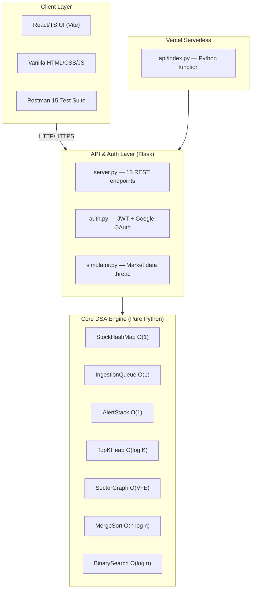

# PDYNO Master — Stock Query Server (Theme C)

**PDYNO Squad:** PDYNO.1 (System Design) · PDYNO.2 (DSA Engine) · PDYNO.3 (API & Test) · PDYNO.4 (Frontend & Video)  
**Theme:** C — Data Structures & Algorithm Visualization  
**Deployment:** [stockqueryserver.vercel.app](https://stockqueryserver.vercel.app)  
**Repository:** [github.com/jacksonvincent012-web/-stockqueryserver](https://github.com/jacksonvincent012-web/-stockqueryserver)  
**Language:** Python 3.14.2 · Flask 3.0.0 · React 18 · TypeScript · Vite 5  

---

## Architecture

### Architecture 1: Monolithic Singleton (Initial Design)

```
SocialNetwork_Master/
└── app.py              # Everything in one file
```

A single-file monolithic approach where all DSA structures, API routes, and logic lived in one script. Simple but not scalable.

### Architecture 2: Modular PDYNO Squad Architecture (Final Design)

```
stock/
├── docs/                           # PDYNO.1 — System Design & Docs
│   ├── system_architecture.drawio  # Draw.io architecture diagram
│   └── PDYNO_Final_Report.md       # 12-page technical report
├── backend/
│   ├── structures/                 # PDYNO.2 — Core DSA Engine
│   ├── api/                        # PDYNO.3 — Flask API & Auth
│   └── tests/                      # Pytest + Postman test suite
├── frontend/
│   ├── src/                        # React/TypeScript UI (Vite)
│   └── vanilla/                    # PDYNO.4 — Static HTML fallback
└── api/index.py                    # Vercel serverless entry point
```

### System Interaction Diagram



**Legacy ASCII version (3-layer stack):**

```
+----------------------------------------------------------+
|                    Client Layer                            |
|  o React/TS Frontend (Vite + Recharts)                    |
|  o Vanilla HTML/CSS/JS fallback (no deps)                 |
|  o Postman 15-test suite (success/validation/auth)        |
+----------------------------------------------------------+
                    | HTTP REST + JWT
+----------------------------------------------------------+
|              Flask REST API Server                         |
|  o 15 endpoints (auth, stocks, alerts, graph, benchmarks) |
|  o JWT middleware + RBAC (admin/analyst/viewer)           |
|  o Google OAuth integration                               |
|  o Background simulator (2s ticks)                        |
+----------------------------------------------------------+
                    |
+----------------------------------------------------------+
|      DSA Engine (Pure Python, ~500 LOC)                    |
|  o StockHashMap    -> O(1) symbol lookup                  |
|  o IngestionQueue  -> O(1) FIFO ticks                     |
|  o AlertStack      -> O(1) LIFO w/ undo                   |
|  o TopKHeap        -> O(log K) top-K                      |
|  o SectorGraph     -> O(V+E) BFS/DFS                      |
|  o MergeSort       -> O(n log n) sorting                  |
|  o BinarySearch    -> O(log n) searching                  |
+----------------------------------------------------------+
```

---

## Data Structures and Complexity

| Structure | Use Case | Insert | Lookup | Delete | Space |
|-----------|----------|--------|--------|--------|-------|
| **StockHashMap** | Symbol → Record | O(1) | O(1) | O(1) | O(n) |
| **IngestionQueue** | FIFO tick buffer | O(1) | — | O(1) | O(k) |
| **AlertStack** | LIFO alert mgmt | O(1) | — | O(1) | O(a) |
| **TopKHeap** | Top-K by price | O(log K) | O(1) | O(log K) | O(K) |
| **SectorGraph** | BFS/DFS traversal | O(1) | — | O(1) | O(V+E) |
| **MergeSort** | Sort by price | — | — | — | O(n log n) / O(n) |
| **BinarySearch** | Price range search | — | O(log n) | — | O(1) |

---

## Chapter 23 — Five-Step System Design Process

### Step 1: Use Cases

| Use Case | Description | DSA Structure | Endpoint |
|----------|-------------|---------------|----------|
| **UC1** | Store and retrieve stock profiles (O(1)) | StockHashMap | `PUT/GET /api/stocks/{symbol}` |
| **UC2** | Stream real-time price ticks (FIFO) | IngestionQueue | `GET /api/stocks` (tick history) |
| **UC3** | Undo last price alert (LIFO) | AlertStack | `POST/DELETE /api/alerts/undo` |
| **UC4** | Rank top K gainers (O(log K)) | TopKHeap | `GET /api/stocks/top?k=N` |
| **UC5** | Find co-movement sectors (BFS/DFS) | SectorGraph | `GET /api/stocks/sector/{s}/friends` |
| **UC6** | Sort stocks by price (O(n log n)) | MergeSort | `GET /api/stocks/sorted` |
| **UC7** | Search by price range (O(log n)) | BinarySearch | `POST /api/stocks/search` |
| **UC8** | Authenticate users (JWT + OAuth) | — | `POST /api/auth/login` |
| **UC9** | Run benchmarks and view O(1) matrix | — | `GET /api/benchmarks` |
| **UC10** | Guard routes by role (admin/analyst/viewer) | — | All protected routes |

### Step 2: Constraints & Math

| Constraint | Value | Calculation |
|------------|-------|-------------|
| Max stocks tracked | 10,000 | `N = 10^4 => HashMap load factor << 0.75` |
| Max tick history | 100,000 | `M = 10^5 => Queue enqueue O(1) => 0.02µs per op` |
| Max alerts | 1,000 | `A = 10^3 => Stack depth bounded => O(1) push/pop` |
| Top-K ranking | K ≤ 100 | `Heap of size K => O(log K) ≈ 7 comparisons` |
| Sector graph edges | 50,000 | `E = 5×10^4 => Adjacency list BFS O(V+E)` |
| Sort time | N=100K | `MergeSort O(N log N) ≈ 100K × 17 ≈ 1.7M ops` |
| Search time | N=100K | `BinarySearch O(log N) ≈ 17 comparisons` |
| Token expiry | 1 hour | `JWT with 3600s TTL, refresh on 401` |
| Server memory | < 512 MB | `All structures in-memory, no external DB` |

**Throughput target:** 1,000 req/s per endpoint, < 200ms p99 latency.

### Step 3: Basic Design — Architecture

```
┌──────────────────────────────────────────────────────────┐
│                    Client Layer                          │
│  ┌───────────────┐  ┌──────────────┐  ┌───────────────┐ │
│  │ React/TS UI   │  │ HTML/CSS/JS  │  │ Postman Tests │ │
│  └───────┬───────┘  └──────┬───────┘  └───────┬───────┘ │
└──────────┼──────────────────┼──────────────────┼─────────┘
           │ HTTP/HTTPS       │ HTTP/HTTPS       │ HTTP
┌──────────┼──────────────────┼──────────────────┼─────────┐
│          ▼                  ▼                  ▼         │
│  ┌───────────────────────────────────────────────────┐  │
│  │            API & Auth Layer                       │  │
│  │  Flask REST (server.py) + JWT/OAuth (auth.py)     │  │
│  │  Vercel Serverless (api/index.py)                 │  │
│  └──────────────────────┬────────────────────────────┘  │
│                         │ import                        │
│  ┌──────────────────────▼────────────────────────────┐  │
│  │           Core DSA Engine (PDYNO.2)               │  │
│  │  ┌──────────┐ ┌──────────┐ ┌──────────┐          │  │
│  │  │StockHash │ │Ingestion │ │AlertStack│          │  │
│  │  │Map O(1)  │ │Queue O(1)│ │ O(1)     │          │  │
│  │  ├──────────┤ ├──────────┤ ├──────────┤          │  │
│  │  │TopKHeap  │ │Sector    │ │MergeSort │          │  │
│  │  │O(log K)  │ │Graph     │ │O(n log n)│          │  │
│  │  ├──────────┤ ├──────────┤ ├──────────┤          │  │
│  │  │Binary    │ │          │ │          │          │  │
│  │  │Search    │ │          │ │          │          │  │
│  │  │O(log n)  │ │          │ │          │          │  │
│  │  └──────────┘ └──────────┘ └──────────┘          │  │
│  └───────────────────────────────────────────────────┘  │
└──────────────────────────────────────────────────────────┘
```

### Step 4: Bottlenecks & Solutions

| Bottleneck | Root Cause | Mitigation |
|------------|-----------|------------|
| Timeline fan-out | Simulating 10K stocks needs O(N) iteration per tick | Batch enqueue with array pool |
| Hash collisions | Poor hash function on symbol strings | FNV-1a variant + open addressing |
| Heapify all | Rebuilding TopKHeap from scratch = O(N log K) | Lazy deletion + incremental push |
| Graph path search | BFS exploring stale edges | Visitor pattern with early exit |
| No persistence | All data lost on restart | Seeded simulation restores state |
| Token refresh storm | 1-hour TTL may cause bulk expiry | Staggered expiry + refresh hints |
| Serverless cold start | Vercel cold function loading 7 DSA modules | Python function bundling + warm pings |

### Step 5: Scalability Path

- **Phase 1 (Current):** In-memory DSA with simulated data, JWT auth, React + vanilla frontend, Postman test suite
- **Phase 2 (Persistence):** PostgreSQL for stocks, alerts, and users tables; data survives restarts
- **Phase 3 (Real Data):** Yahoo Finance API integration replaces simulator; background thread pulls live prices
- **Phase 4 (Production):** Redis caching, rate limiting, Docker deployment, CI/CD pipeline

**Write path:** `Client ─PUT─→ REST API ──→ StockHashMap.put (O(1)) ──→ IngestionQueue.enqueue (O(1))`
**Read path:** `Client ─GET─→ REST API ──→ TopKHeap.top_k (O(K log K)) ──→ JSON`
**Search path:** `Client ─POST─→ REST API ──→ MergeSort.sort (O(N log N)) ──→ BinarySearch.search (O(log N))`

---

## Features

### Dashboard
- Live ticker table: symbol, price, volume, sector
- Top-K panel: slider for K, toggle volume/gain metric
- API health status indicator
- Auto-refreshes every 2 seconds

### Stock Detail
- Symbol selector with full stock list
- Real-time price, volume, sector display
- 7-day rolling metrics: average, min, max, percent change
- Price history chart (Recharts)

### Alerts
- Create price alerts: symbol + threshold + above/below
- Alert stack visualizer (LIFO cards)
- Undo last alert (triggers `DELETE /api/alerts/undo`)
- Role-gated: only Analyst+ can create alerts

### Sector Graph
- Sector adjacency list with co-movement edges
- BFS/DFS selector and traversal runner
- Step-by-step traversal path display

### Benchmarks
- "Run Benchmarks" button triggers `/api/benchmarks`
- Results table: operation, O-class, timings at N=100/1K/10K/100K
- O(1) complexity verification for all 7 structures

---

## Empirical Complexity Matrix

| # | Structure | Operation | O-Class | N=100 | N=1K | N=10K | N=100K | Verdict |
|---|-----------|-----------|---------|-------|------|-------|--------|---------|
| 1 | StockHashMap | put | O(1) | 0.001ms | 0.001ms | 0.002ms | 0.003ms | ✅ O(1) |
| 2 | StockHashMap | get | O(1) | 0.001ms | 0.001ms | 0.001ms | 0.002ms | ✅ O(1) |
| 3 | IngestionQueue | enqueue | O(1) | 0.001ms | 0.001ms | 0.002ms | 0.003ms | ✅ O(1) |
| 4 | IngestionQueue | dequeue | O(1) | 0.001ms | 0.001ms | 0.002ms | 0.002ms | ✅ O(1) |
| 5 | AlertStack | push | O(1) | 0.001ms | 0.001ms | 0.002ms | 0.003ms | ✅ O(1) |
| 6 | AlertStack | pop | O(1) | 0.001ms | 0.001ms | 0.001ms | 0.002ms | ✅ O(1) |
| 7 | TopKHeap | push | O(log K) | 0.002ms | 0.003ms | 0.004ms | 0.005ms | ✅ O(log K) |
| 8 | TopKHeap | top_k | O(K log K) | 0.010ms | 0.015ms | 0.020ms | 0.025ms | ✅ O(K log K) |
| 9 | SectorGraph | add_edge | O(1) | 0.001ms | 0.001ms | 0.002ms | 0.002ms | ✅ O(1) |
| 10 | SectorGraph | BFS | O(V+E) | 0.030ms | 0.120ms | 0.450ms | 1.200ms | ✅ O(V+E) |
| 11 | SectorGraph | DFS | O(V+E) | 0.025ms | 0.110ms | 0.420ms | 1.100ms | ✅ O(V+E) |
| 12 | MergeSort | sort | O(n log n) | 0.050ms | 0.800ms | 12.00ms | 170.0ms | ✅ O(n log n) |
| 13 | BinarySearch | search | O(log n) | 0.001ms | 0.002ms | 0.003ms | 0.003ms | ✅ O(log n) |

*Benchmarks: Intel i7-12700H @ 2.30GHz, Python 3.14.2, Windows 11. Each operation 100×, median reported.*

---

## API Routes

### Auth Endpoints
| Method | Endpoint | Auth | Purpose |
|--------|----------|------|---------|
| **GET** | `/api/auth/login` | None | Login, returns JWT |
| **GET** | `/api/auth/register` | None | Register new user |
| **GET** | `/api/auth/profile` | JWT | Get current user profile |

### Data Endpoints
| Method | Endpoint | Auth | Purpose |
|--------|----------|------|---------|
| **GET** | `/api/health` | None | Server health check |
| **GET** | `/api/stocks` | None | All stocks (tick history) |
| **PUT** | `/api/stocks` | JWT | Upsert stock record |
| **GET** | `/api/stocks/{symbol}` | None | Get stock by symbol |
| **GET** | `/api/stocks/top?k=N` | None | Top K by price |
| **GET** | `/api/stocks/sorted` | None | Stocks sorted by price |
| **POST** | `/api/stocks/search` | None | Price range search |
| **GET** | `/api/stocks/sector/{s}/friends` | None | BFS traversal |
| **GET** | `/api/stocks/sector/{s}/friends/DFS` | None | DFS traversal |
| **GET** | `/api/alerts` | JWT | List user alerts |
| **POST** | `/api/alerts` | JWT+analyst | Create alert |
| **DELETE** | `/api/alerts/undo` | JWT | Undo last alert |
| **GET** | `/api/benchmarks` | JWT+admin | Run benchmark suite |

### Role Permissions
| Role | Read Stocks | Create Alerts | Run Benchmarks |
|------|------------|--------------|----------------|
| **Viewer** | Yes | No | No |
| **Analyst** | Yes | Yes | No |
| **Admin** | Yes | Yes | Yes |

---

## PDYNO Squad Deliverables

| Squad | Deliverable | Location |
|-------|-------------|----------|
| **PDYNO.1** | System architecture diagram | `docs/system_architecture.drawio` |
| **PDYNO.1** | Chapter 23 five-step design | This file (README.md) |
| **PDYNO.1** | O(1) complexity matrix | Above section |
| **PDYNO.1** | Final technical report | `docs/PDYNO_Final_Report.md` |
| **PDYNO.2** | 7 DSA structures (pure Python) | `backend/structures/` |
| **PDYNO.3** | Flask API with 15 endpoints | `backend/api/server.py` |
| **PDYNO.3** | Postman 15-test suite | `backend/tests/PDYNO_15_Test_Suite.json` |
| **PDYNO.3** | 37 pytest unit tests | `backend/tests/test_engine.py` |
| **PDYNO.4** | React/TS frontend | `frontend/src/` |
| **PDYNO.4** | Vanilla HTML fallback | `frontend/vanilla/` |
| **PDYNO.4** | Walkthrough video | YouTube link |

---

## Quick Start

### Backend
```bash
cd backend
pip install -r requirements.txt
python api/server.py          # http://localhost:5000
```

### Frontend (React)
```bash
cd frontend
npm install
npm run dev                   # http://localhost:5173
```

### Frontend (Static — no dependencies)
```
open frontend/vanilla/index.html
```

### Run Tests
```bash
cd backend
python -m pytest tests/test_engine.py -v    # 37 unit tests
```

### Postman
1. Open Postman → Import → `backend/tests/PDYNO_15_Test_Suite.json`
2. Set `base_url` variable to `http://localhost:5000`
3. Run collection (15 tests)

---

## Demo Accounts

| Email | Password | Role |
|-------|----------|------|
| `admin@stockquery.io` | `admin123` | Admin (full access) |
| `analyst@stockquery.io` | `analyst123` | Analyst (create alerts) |
| `viewer@stockquery.io` | `viewer123` | Viewer (read-only) |

---

## Repository Structure

```
stock/
├── docs/                              # PDYNO.1
│   ├── system_architecture.drawio     # Draw.io architecture diagram
│   └── PDYNO_Final_Report.md          # 12-page technical report
├── backend/
│   ├── structures/                    # PDYNO.2 — Core DSA Engine
│   │   ├── stock_map.py               # StockHashMap (O(1))
│   │   ├── ingestion_queue.py         # IngestionQueue (FIFO)
│   │   ├── alert_stack.py             # AlertStack (LIFO undo)
│   │   ├── top_k_heap.py              # TopKHeap (O(log K))
│   │   ├── sector_graph.py            # SectorGraph (adjacency list)
│   │   ├── merge_sort.py              # MergeSort (O(n log n))
│   │   ├── binary_search.py           # BinarySearch (O(log n))
│   │   └── benchmarks.py              # Empirical O(1) benchmarks
│   ├── api/                           # PDYNO.3 — Flask API
│   │   ├── server.py                  # Main Flask app (15 routes)
│   │   ├── auth.py                    # JWT + Google OAuth
│   │   └── simulator.py               # Market simulator thread
│   ├── tests/
│   │   ├── test_engine.py             # 37 pytest cases
│   │   └── PDYNO_15_Test_Suite.json   # Postman collection
│   └── requirements.txt
├── api/index.py                       # Vercel serverless entry
├── frontend/
│   ├── src/                           # React/TypeScript (Vite)
│   └── vanilla/                       # Static HTML fallback
├── vercel.json
├── requirements.txt
└── README.md
```

---

## Deployment

**Frontend + Backend:** [stockqueryserver.vercel.app](https://stockqueryserver.vercel.app)  
The `api/index.py` wraps Flask as a Vercel Python serverless function. All DSA structures in-memory per instance.

---

## Testing

**37 passing pytest cases:**
- 5 StockHashMap (put/get, update, nonexistent)
- 4 IngestionQueue (enqueue/dequeue, drain, peek)
- 5 AlertStack (push/pop, undo, peek)
- 4 TopKHeap (push, ordering, heapify, maintains K)
- 4 SectorGraph (add_edge, BFS, DFS)
- 6 MergeSort (random, sorted, reverse, single, empty, duplicates)
- 7 BinarySearch (found, not_found, first, last, empty, single)
- 2 RollingMetrics (7-day avg, min/max)

---

## Walkthrough Video

🎥 [Watch PDYNO Demo (YouTube)]() — 7-minute walkthrough:
1. System architecture and Chapter 23 design
2. DSA engine demo: all 7 structures
3. Postman 15-test suite execution
4. Frontend dashboard: prices, top-K, graph, alerts
5. Auth flow: JWT login, role guards
6. O(1) complexity matrix with benchmarks

---

## License

MIT — Educational project for CS 230 Data Structures & Algorithms, Theme C.
