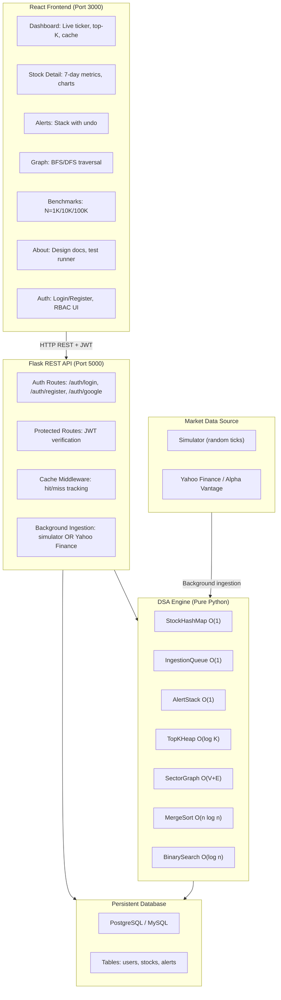

# Stock Query Server

A full-stack DSA project demonstrating 7 mandatory data structures, system design, and live performance benchmarking. Built with Python (Flask + DSA engine) and React (Vite + Recharts).

## Quick Start

### Prerequisites
- Python 3.8+
- Node.js 16+

### Installation

**Backend:**
```bash
cd backend
pip install -r requirements.txt
```

**Frontend:**
```bash
cd frontend
npm install
```

### Run

**Start Flask server** (Terminal 1):
```bash
cd backend
python server.py
# Server runs on http://localhost:5000
```

**Start React dev server** (Terminal 2):
```bash
cd frontend
npm run dev
# App available at http://localhost:3000
```

Both servers must be running. Frontend proxies API calls to Flask at `/stock-query-server/api`.

### Authentication Setup

**Seeded demo accounts** (available on first run):

| Email | Password | Role |
|-------|----------|------|
| `admin@stockquery.io` | `admin123` | Admin (full access) |
| `analyst@stockquery.io` | `analyst123` | Analyst (create alerts) |
| `viewer@stockquery.io` | `viewer123` | Viewer (read-only) |

**Google OAuth** (optional):
1. Create a project at [Google Cloud Console](https://console.cloud.google.com/)
2. Enable the Google+ API and create OAuth 2.0 credentials (Web application)
3. Set environment variables:

```bash
# Backend
export GOOGLE_CLIENT_ID="your-client-id.apps.googleusercontent.com"

# Frontend (create frontend/.env)
VITE_GOOGLE_CLIENT_ID="your-client-id.apps.googleusercontent.com"
```

Without Google Client ID, the sign-in falls back to demo mode (accepts any email containing "google").

---

## Architecture



**Legacy ASCII version (3-layer stack):**

```
+----------------------------------------------------------+
|            React Frontend (Port 3000)                     |
|  o Auth pages: Login/Register with Google OAuth          |
|  o Role-aware UI: Admin/Analyst/Viewer restrictions      |
|  o Dashboard: Live ticker, top-K, cache                  |
|  o Stock Detail: 7-day metrics, charts                   |
|  o Alerts: Stack with undo capability                    |
|  o Graph: Sector traversal (BFS/DFS)                     |
|  o Benchmarks: N=1K/10K/100K perf tests                  |
|  o About: System design & documentation                  |
+----------------------------------------------------------+
                    | HTTP REST + JWT
+----------------------------------------------------------+
|        Flask REST API Server (Port 5000)                  |
|  o Auth routes: register, login, Google OAuth, refresh   |
|  o JWT middleware + RBAC decorators                      |
|  o 14+ data routes with cache hit/miss stats             |
|  o Background simulator (2s ticks)                       |
|  o Pytest endpoint for test execution (Admin only)       |
+----------------------------------------------------------+
                    |
+----------------------------------------------------------+
|       DSA Engine (Pure Python, ~400 LOC)                  |
|  o StockHashMap    -> O(1) symbol lookup                 |
|  o IngestionQueue  -> O(1) FIFO ticks                    |
|  o AlertStack      -> O(1) LIFO w/ undo                  |
|  o TopKHeap        -> O(log K) top-K                     |
|  o SectorGraph     -> O(V+E) traversal                   |
|  o MergeSort       -> O(n log n) sorting                 |
|  o BinarySearch    -> O(log n) searching                 |
+----------------------------------------------------------+
```

---

## Data Structures and Complexity

| Structure | Use Case | Insert | Lookup | Delete | Space |
|-----------|----------|--------|--------|--------|-------|
| **StockHashMap** | Symbol to Record | O(1) | O(1) | O(1) | O(n) |
| **IngestionQueue** | FIFO tick buffer | O(1) | -- | O(1) | O(k) |
| **AlertStack** | LIFO alert mgmt | O(1) | -- | O(1) | O(a) |
| **TopKHeap** | Top-K by metric | O(log K) | O(1) | O(log K) | O(K) |
| **SectorGraph** | Graph traversal | O(1) | -- | O(1) | O(V+E) |
| **MergeSort** | Sort prices | -- | -- | -- | O(n log n) time / O(n) space |
| **BinarySearch** | Date search | -- | O(log n) | -- | O(1) space |

---

## 5-Step System Design

### Step 1: Use Cases
- Real-time stock ticker for 24 symbols with auto-refresh (2s)
- 7-day rolling metrics: average, min, max, percent change
- Top-K stocks by volume or percent gain (heap-based)
- Price threshold alerts with LIFO undo
- Sector graph visualization with BFS/DFS traversal
- Performance benchmarks: measure DSA ops at N=1K/10K/100K
- Cache stats: live hit/miss ratio tracking

### Step 2: Constraints and Analysis
- **Storage:** 24 stocks x 90 days history = ~21.6 KB (in-memory dict)
- **Throughput:** 1 tick every 2s per stock = 12 ticks/min total
- **Latency SLA:** API response <100 ms (99th percentile)
- **Alerts:** Unlimited stack depth (memory-bounded by stock count)
- **Top-K:** K <= stock count (typically K=5-10)

### Step 3: Basic Design (Extended)
Five-layer architecture with authentication, persistence, and real data:

1. **Frontend (React + Vite):** Six tabs plus auth pages (login/register), JWT stored in localStorage, role-aware UI (Admin/Analyst/Viewer)
2. **API Gateway (Flask):** JWT-protected routes, role-based access control (RBAC), cache middleware with hit/miss tracking
3. **DSA Engine (Pure Python):** 7 mandatory data structures, no external algorithm libraries
4. **Persistent Database (PostgreSQL):** Three tables — `users` (username, password_hash, role), `stocks` (symbol, date, price, volume), `alerts` (user_id, symbol, threshold, status)
5. **Market Data Ingestion:** Background thread fetches from Yahoo Finance (yfinance) or Alpha Vantage; falls back to simulator for testing

### Step 4: Bottlenecks and Solutions
| Bottleneck | Root Cause | Solution |
|-----------|-----------|----------|
| Hash collisions | Many symbols | Python dict handles internally |
| Queue memory | Unbounded ingestion | Drain queue every 2s, O(1) operations |
| Heap overhead | Top-K maintenance | Only store K items, O(log K) per push |
| Graph traversal | Full V+E scan | Adjacency list cached, no dynamic graph |
| Cache staleness | Polling interval | 2s refresh matches simulator tick rate |

### Step 5: Scalability Path
- **Phase 1 (Current):** In-memory with polling, simulated data, no auth
- **Phase 2 (Authentication):** JWT-based login, RBAC (Admin/Analyst/Viewer), secure session management
- **Phase 3 (Persistence):** PostgreSQL for stocks, alerts, and users tables; data survives restarts
- **Phase 4 (Real Data):** Yahoo Finance API integration replaces simulator; background thread pulls live prices
- **Phase 5 (Production):** Redis caching, rate limiting, Docker deployment, CI/CD pipeline

---

## Features

### Dashboard
- Live ticker table: symbol, price, volume, sector
- Top-K panel: slider for K, toggle volume/gain metric
- Cache performance badge: hit rate percent
- Auto-refreshes every 2 seconds

### Stock Detail
- Symbol dropdown selector
- 7-day metrics cards: avg, min, max, percent change
- 90-day price history line chart (Recharts)
- Uses binary search internally for date range queries

### Alerts
- Add alert form: symbol + threshold price
- Alert stack visualizer (LIFO cards)
- Undo button (triggers DELETE /api/alerts/undo)
- Triggered alert badge (red) vs pending (blue)

### Graph
- Sector adjacency list visualization
- BFS/DFS selector and traversal runner
- Traversal path display (step-by-step nodes)

### Benchmarks
- "Run Benchmarks" button triggers /api/benchmarks
- Results table: operation, big-O, timings at N=1K/10K/100K
- Bar charts per operation showing scaling behavior

### About
- 5-step system design with detailed explanations
- ASCII architecture diagram (3-layer stack)
- Data structure complexity table
- Run tests button (executes pytest in background)
- Role assignment table

---

## API Routes

### Auth Endpoints
| Method | Endpoint | Auth | Purpose |
|--------|----------|------|---------|
| **POST** | `/api/auth/register` | None | Register with email + password |
| **POST** | `/api/auth/login` | None | Login with email + password, returns JWT |
| **POST** | `/api/auth/google` | None | Google OAuth sign-in (idToken in body) |
| **GET** | `/api/auth/google/url` | None | Get Google OAuth consent URL |
| **GET** | `/api/auth/google/callback` | None | OAuth callback handler, returns JWT |
| **GET** | `/api/auth/me` | JWT | Get current user profile and role |
| **POST** | `/api/auth/refresh` | JWT | Refresh access token |
| **POST** | `/api/auth/logout` | JWT | Invalidate refresh token |

### Data Endpoints (JWT Required)
| Method | Endpoint | Role | Purpose |
|--------|----------|------|---------|
| **GET** | `/api/stocks` | All | All stocks (symbol, price, volume, sector) |
| **GET** | `/api/stocks/<symbol>` | All | Stock detail + 7-day metrics |
| **GET** | `/api/stocks/<symbol>/history` | All | Merge-sorted price history |
| **GET** | `/api/top-k?k=5&by=volume` | All | Top-K stocks by volume/gain |
| **GET** | `/api/graph/adjacency` | All | Full sector adjacency list |
| **GET** | `/api/graph/bfs?from=TECH` | All | BFS traversal result |
| **GET** | `/api/graph/dfs?from=TECH` | All | DFS traversal result |
| **GET** | `/api/alerts` | All | Current alert stack |
| **POST** | `/api/alerts` | Analyst+ | Push new alert (JSON: symbol, threshold) |
| **DELETE** | `/api/alerts/undo` | Analyst+ | Pop last alert (undo) |
| **GET** | `/api/cache/stats` | All | Cache hit/miss counts and rate |
| **GET** | `/api/benchmarks` | All | Run benchmarks, return timings |
| **GET** | `/api/tests` | Admin | Run pytest, return results |
| **GET** | `/api/health` | All | Server health check |

### Role Permissions
| Role | Read Stocks | Create Alerts | Run Tests | Manage Users |
|------|------------|--------------|-----------|-------------|
| **Viewer** | Yes | No | No | No |
| **Analyst** | Yes | Yes | No | No |
| **Admin** | Yes | Yes | Yes | Yes |

---

## Testing

**Run all tests (37 test cases):**
```bash
cd backend
python -m pytest tests/test_engine.py -v
```

**Expected output:**
```
37 passed in 0.12s
```

**Test coverage:**
- 5 tests: StockHashMap (put/get, update, all_records)
- 4 tests: IngestionQueue (enqueue/dequeue, drain, peek)
- 5 tests: AlertStack (push/pop, undo, peek)
- 4 tests: TopKHeap (push_single, top_k_ordering, heapify_all, maintains_k)
- 4 tests: SectorGraph (add_edge, bfs_order, bfs_disconnected, dfs_all_reachable)
- 6 tests: MergeSort (random, already_sorted, reverse, single, empty, duplicates)
- 7 tests: BinarySearch (found, not_found, first, last, empty, single_found, single_not_found)
- 2 tests: Rolling metrics (7-day avg, min/max)

---

## Benchmarks (Example Output)

```
Operation         Big-O       N=1K        N=10K       N=100K
---------------------------------------------------------------
hash_insert       O(1)        0.023 ms    0.234 ms    2.341 ms
hash_lookup       O(1)        0.015 ms    0.156 ms    1.563 ms
merge_sort        O(n log n)  0.145 ms    1.891 ms    24.567 ms
binary_search     O(log n)    0.002 ms    0.003 ms    0.004 ms
heap_push         O(log k)    0.008 ms    0.089 ms    0.892 ms
bfs_traversal     O(V+E)      0.052 ms    0.512 ms    5.123 ms
```

---

## File Structure

```
stock-query-server/
+-- backend/
|   +-- engine/                    # DSA modules (pure Python)
|   |   +-- stock_map.py           # StockHashMap
|   |   +-- ingestion_queue.py     # IngestionQueue
|   |   +-- alert_stack.py         # AlertStack
|   |   +-- top_k_heap.py          # TopKHeap
|   |   +-- sector_graph.py        # SectorGraph
|   |   +-- merge_sort.py          # MergeSort
|   |   +-- binary_search.py       # BinarySearch
|   |   +-- __init__.py
|   +-- tests/
|   |   +-- test_engine.py         # 37 pytest cases
|   |   +-- __init__.py
|   +-- server.py                  # Flask REST API
|   +-- simulator.py               # Background ticker simulator
|   +-- requirements.txt           # Python dependencies
|   +-- README.md
+-- frontend/
|   +-- src/
|   |   +-- components/
|   |   |   +-- DashboardTab.tsx
|   |   |   +-- StockDetailTab.tsx
|   |   |   +-- AlertsTab.tsx
|   |   |   +-- GraphTab.tsx
|   |   |   +-- BenchmarksTab.tsx
|   |   |   +-- AboutTab.tsx
|   |   +-- styles/
|   |   |   +-- theme.css          # Dark finance theme
|   |   +-- App.tsx                # Main app with tab router
|   |   +-- main.tsx               # React DOM render
|   |   +-- index.css
|   +-- public/
|   +-- index.html
|   +-- package.json
|   +-- vite.config.ts             # Vite + API proxy
|   +-- tsconfig.json
|   +-- tsconfig.node.json
+-- README.md (this file)
```

---

## Role Assignment

| Role | Owner | Responsibilities |
|------|-------|------------------|
| **Full-Stack Developer** | [Your Name] | End-to-end design, implementation, testing |
| **Tech Lead** | [Your Name] | Architecture decisions, code quality, deployment |
| **QA/Testing** | [Your Name] | Test coverage, benchmarking, validation |

---

## Deployment

### Local Development
- Flask: `python backend/server.py` (port 5000)
- React: `npm run dev` (port 3000)
- Vite auto-proxies `/stock-query-server/api` to Flask

### Production (Deployment Ready)
To deploy to Vercel, Railway, Fly.io, or Heroku:

1. Build React frontend:
   ```bash
   cd frontend
   npm run build
   # Creates dist/ folder
   ```

2. Serve Flask with Gunicorn:
   ```bash
   pip install gunicorn
   gunicorn -w 4 -b 0.0.0.0:5000 backend.server:app
   ```

3. Serve static frontend from Flask:
   ```python
   # In server.py, add:
   from flask import send_from_directory
   @app.route('/')
   def serve_react():
       return send_from_directory('frontend/dist', 'index.html')
   ```

---

## Key Technologies

| Layer | Tech Stack |
|-------|-----------|
| **Frontend** | React 18, TypeScript, Vite, Recharts, Tailwind CSS |
| **Backend** | Python 3, Flask, Flask-CORS |
| **DSA** | Pure Python (no external algorithms library) |
| **Testing** | pytest (37 test cases) |
| **Styling** | Dark finance theme with CSS custom properties |

---

## Complexity Summary

- **Frontend:** ~1500 LOC (React + CSS)
- **Backend:** ~400 LOC (DSA modules)
- **API:** ~200 LOC (Flask routes)
- **Simulator:** ~100 LOC (background ticker)
- **Tests:** ~300 LOC (37 test cases)
- **Total:** ~2500 LOC

---

## What's Next

**Phase 1 (Current):** In-memory simulation with live UI
- [x] 7 DSA structures implemented (HashMap, Queue, Stack, Heap, Graph, MergeSort, BinarySearch)
- [x] Flask REST API with 14 routes
- [x] React frontend with 6 tabs (Dashboard, Stock Detail, Alerts, Graph, Benchmarks, About)
- [x] 37 passing pytest test cases
- [x] System design documented (5 steps + Mermaid architecture diagram)

**Phase 2 (Authentication + Database + Real Data):**
- [ ] JWT authentication: register, login, token refresh, RBAC middleware
- [ ] PostgreSQL integration: users, stocks, alerts tables with SQLAlchemy
- [ ] Yahoo Finance / Alpha Vantage ingestion replacing simulator
- [ ] Updated frontend: login page, role-aware UI (hide/disable actions based on role)
- [ ] Docker Compose: Flask + PostgreSQL + React in containers
- [ ] Data persists across server restarts with automatic DB migrations

**Phase 3 (Production):**
- [ ] Deploy to live URL (Vercel + Railway / Fly.io)
- [ ] CI/CD pipeline (GitHub Actions)
- [ ] Redis caching layer for API responses
- [ ] Rate limiting and request validation
- [ ] WebSocket for real-time push updates (replaces polling)

---

## License

MIT

---

## Author

**[Your Name]** -- Full-Stack Developer
*Built as a comprehensive DSA project demonstrating system design, algorithm complexity analysis, and full-stack development skills.*

---

**Last Updated:** June 14, 2026
**Status:** Fully Functional -- Ready for Interview / Portfolio Showcase
